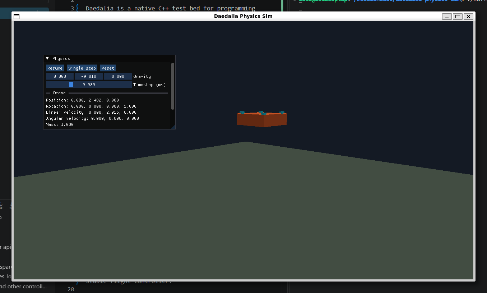

# Daedalia Physics Sim

Daedalia is a native C++ test bed for programming simulated sensors and flight controllers.

The goal is to experiment with control software against a physical vehicle model: the simulator turns rigid-body state into sensor readings, passes those readings to a controller, and applies the controller's motor commands back to the vehicle. The current vehicle is a quadcopter, but the same approach is intended to support other aircraft, sensor models, and control strategies.

```text
Jolt physics -> simulated sensors -> flight controller -> motor model -> forces and torques
```



## Current state

- A Jolt rigid-body simulation running at a configurable fixed frequency.
- Ideal IMU, local GPS, barometer, and magnetometer models.
- A controller interface that receives ideal IMU, GPS, barometer, and magnetometer samples.
- Four normalized motor outputs driving quadcopter thrust and reaction torque.
- An OpenGL view and ImGui panel for inspecting ground truth, sensor output, and simulation state.

The included controllers provide a constant-throttle demo, angle-limited manual control, unlimited-angle HorizonMode control, and movable position hold.

## Build and run

Requirements are a C++20 compiler, CMake 3.24 or newer, Python 3, and OpenGL development libraries.

```sh
cmake -S . -B build
cmake --build build
./build/daedalia
```

CMake downloads SDL, Jolt Physics, GLM, glad, and Dear ImGui during the first configuration.

Run the headless simulation smoke test with:

```sh
ctest --test-dir build --output-on-failure
```

The smoke test initializes and steps the real physics simulation without opening a window.

## Controls

- Hold the right mouse button and move the mouse to look around, or orbit the drone while camera follow is enabled.
- Use `W`, `A`, `S`, and `D` to move.
- Use `Space` to rise and `Ctrl` to descend.
- Hold `Shift` to move faster.
- Enable `Follow drone` in the `Physics` panel to keep the camera aimed at and moving with the drone.
- Select controller slot `2` for AngleMode. `W`/`S` command pitch, `A`/`D` command roll, `Q`/`E` change heading, and `R`/`F` change throttle.
- Select controller slot `3` for HorizonMode. It uses the same controls, but holding pitch or roll continuously rotates the target so flips are possible.
- Select controller slot `4` for Position Hold. `W`/`S` move the held target forward/backward, `A`/`D` move it sideways, `Q`/`E` change heading, and `R`/`F` change altitude.

The `Physics` panel can pause, reset, or single-step the simulation, set the physics frequency from 1 to 120 Hz, adjust gravity and camera follow, and inspect the drone's ground-truth state. The default physics frequency is 30 Hz.

The `Sensors` panel shows the latest ideal IMU, GPS, barometer, and magnetometer samples. GPS uses the simulator's local world coordinates, the barometer treats world `Y = 0` as sea level, and magnetic north points along world `-Z`.

## Extending the simulator

- Sensor behavior and physics-independent sample types live in `src/sensors/`.
- Flight controllers and their physics-independent input/output contract live in `src/controllers/`.
- Vehicle geometry, motors, and force application live in `src/drone.*`.
- `src/app/` owns the fixed-step simulation, application loop, rendering, and debug UI; `src/main.cpp` is the launcher.

The position-hold controller is a standalone closed loop that uses only simulated sensor samples; ground truth remains limited to the simulation and debug UI.
